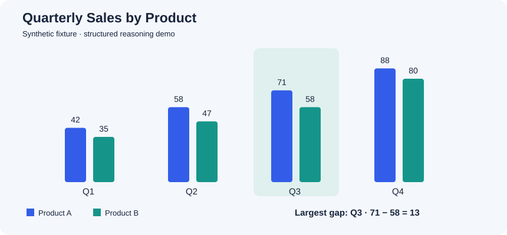
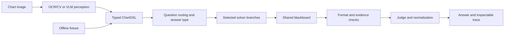

# Chart Reasoning Agents

**Inspect how a chart answer is produced: structured data, routed solvers, candidate evidence, critique, and a final decision.**

A CSE 252D team research project with two complementary implementations: an LLM-assisted image pipeline and a deterministic blackboard workflow. This portfolio edition includes an offline demo, historical prediction audits, and explicit reproducibility limits.



> **Demo:** Which quarter has the largest gap between Product A and Product B?  
> **Answer:** Q3 — the gaps are 7, 11, **13**, and 8.

## Try it in one minute

Python 3.10+; no API key, OCR installation, dataset download, or GPU needed for this demo.

```bash
python -m pip install -r requirements-demo.txt
python scripts/run_blackboard_demo.py --question "Which quarter has the largest gap between Product A and Product B?"
```

The demo reads a **known structured chart fixture**, not image pixels. Its agents are deterministic Python components, not LLM calls. It saves the input, ChartDSL, message trace, and answer under `outputs/`. To supply a different structured chart:

```bash
python scripts/run_blackboard_demo.py --dsl examples/sample_chart.json --question "Which quarter has the largest gap between Product A and Product B?"
```

See the [saved example trace](examples/demo-trace.json). `--no-save` disables file output; `--output-dir` selects an output folder.

## Architecture



The diagram shows the design boundary between perception and reasoning, not a claim that every runner follows the same execution path. The LLM pipeline uses sequential CrewAI tasks; the offline demo uses a separate rule-based blackboard implementation.

| Entry point | Input | Purpose |
|---|---|---|
| `scripts/run_blackboard_demo.py` | Built-in or supplied ChartDSL | Tested, no-key reasoning demo |
| `scripts/run_single.py` | Image + question | Optional CrewAI image pipeline; needs external dependencies and credentials |
| `scripts/run_dvqa_baseline.py` | Sample JSONL + images | Single-shot VLM baseline |
| `scripts/run_dvqa_agents.py` | Sample JSONL + images | Sequential multi-agent evaluation |
| `scripts/run_dvqa_agents_blackboard.py` | Sample JSONL + images | Experimental OCR + blackboard route |
| `scripts/run_dvqa_agents_hybrid.py` | Sample JSONL + images | Experimental hybrid route |
| `scripts/verify_results.py` | Included historical predictions | Offline integrity checks and score audit |

## Historical results, audited from saved predictions

**30 paired DVQA reasoning questions per split.** These are small validation samples, not full-benchmark scores or results from this edited portfolio version.

| Split | Baseline strict EM | Agents strict EM | Change |
|---|---:|---:|---:|
| `val_easy` | 15/30 = 50.0% | 20/30 = 66.7% | +16.7 percentage points |
| `val_hard` | 11/30 = 36.7% | 21/30 = 70.0% | +33.3 percentage points |

```bash
python scripts/verify_results.py
python -m unittest discover -s tests -v
```

The verifier rejects duplicate IDs, missing predictions, failed rows, unequal paired sets, inconsistent gold labels, and discrepancies with the saved report. It performs **no new inference**.

The original report describes a GPT-4o-mini comparison, and saved baseline metadata confirms that model identifier. Agent run metadata does **not** record a complete model/environment configuration; exact historical inference reproduction is therefore not established. “Strict EM” here preserves the project's original normalization implementation, not a newly validated official benchmark scorer. See [evaluation and limitations](docs/EVALUATION.md).

## What is implemented

- Pydantic schemas distinguish axis-side **groups** from legend-side **categories**, keeping numerical cells linked to visual-mark indices.
- Specialized comparison, arithmetic, counting, lookup, label, and boolean solvers post candidates to a shared blackboard.
- A format critic and a heuristic evidence-support check feed a deterministic judge. The evidence check is **not an independent factual verifier**.
- The optional CrewAI route includes bounded **reasoning-only repair** when its critic requests it, plus deterministic answer overrides. It does not automatically repair arbitrary perception failures.
- DVQA sampling, prediction logging, paired scoring, and error-analysis utilities are retained.

## Optional image/LLM setup

Install `requirements.txt` in a separate environment, copy `.env.example` to `.env`, and set your provider key locally. The offline perception route also requires a system Tesseract executable. API calls may incur charges.

```bash
python -m pip install -r requirements.txt
python scripts/make_sample_chart.py
python scripts/run_single.py --image examples/sample_chart.png --question "Which quarter has the largest gap between Product A and Product B?"
```

The full environment and live API pipeline have **not been validated in this packaging pass**; dependency ranges are inherited, not a tested lockfile. For dataset setup and explicit evaluation commands, see [reproduction guide](docs/REPRODUCING.md).

## Project map

```text
chart_agents/      Typed schemas, agents, solvers, critics, vision tools, workflows
scripts/           Demo, sampling, evaluation, score verification
dvqa_eval/         Dataset loaders and original scoring functions
examples/          Synthetic chart, structured fixture, saved trace
results/           Minimized historical evidence and recomputed summaries
tests/             Offline behavior and evidence-integrity tests
docs/              Technical report, limitations, provenance and release notes
```

## Report and provenance

- [Technical report](docs/REPORT.md): problem, implementation, results, and failure modes.
- [Attribution](docs/ATTRIBUTION.md): team authors and upstream source; no unsupported individual ownership claims.
- [Packaging changes](docs/CHANGELOG.md): fixes made after the historical experiments.
- [Source hashes](docs/source-manifest.json): local source provenance.

**Status: review candidate.** The source README states MIT, but no standalone license file was found. This edition does not assign new rights to team code or benchmark material. Confirm the applicable license, team/course publication scope, and individual contribution description before publishing. Dataset images, raw archives, credentials, Git history, virtual environments, and the original student-ID-bearing report are not bundled.
